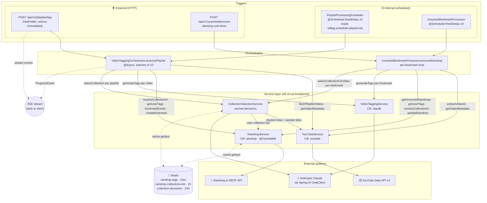

# Architecture

## Data flow: triggers → external systems

VidTag has four entry points that converge on two orchestration code paths and
fan out to three external APIs (YouTube, Raindrop, Anthropic Claude). Redis sits
on the side as a cross-cutting cache.

### Notes

**Trigger symmetry.** Each orchestration path has both a scheduled and an HTTP
trigger that converge on the same code:

| Orchestration                                   | Scheduled trigger              | HTTP trigger                       |
| ----------------------------------------------- | ------------------------------ | ---------------------------------- |
| `VideoTaggingOrchestrator.processPlaylist`      | `PlaylistProcessingScheduler`  | `POST /api/v1/playlists/tag`       |
| `UnsortedBookmarkProcessor.processRaindrop`     | `UnsortedBookmarkProcessor`    | `POST /api/v1/unsorted/process`    |

Schedulers pass a no-op `Consumer<ProgressEvent>` (events get logged at DEBUG
instead of streamed). Anything achievable via the API is therefore also
achievable via the scheduler.

**`CollectionSelectionService` is the most fan-out-y node.** It calls both
YouTube (sample playlist video titles) and Raindrop (user's collection list)
before asking Claude to pick the best collection. That's why the diagram shows
it consuming `YT` and `RD` in addition to `CLAUDE`.

**Per-playlist vs per-bookmark cost.** `VideoTaggingOrchestrator` calls
`selectCollection` **once per playlist**; `UnsortedBookmarkProcessor` calls
`selectCollectionForVideo` **once per bookmark**. The granularity is correct —
an unsorted bookmark has no playlist context — but the unsorted processor pays
N×Claude calls where the playlist orchestrator pays 1×. The 24-hour
`collection-decisions` cache softens this for re-runs but not first pass.

**Resilience.** Every external call goes through a Resilience4J circuit breaker
(`youtube`, `raindrop`, `claude`) with a fallback method that returns a stub
result so a single API outage degrades behavior rather than failing the entire
batch.
